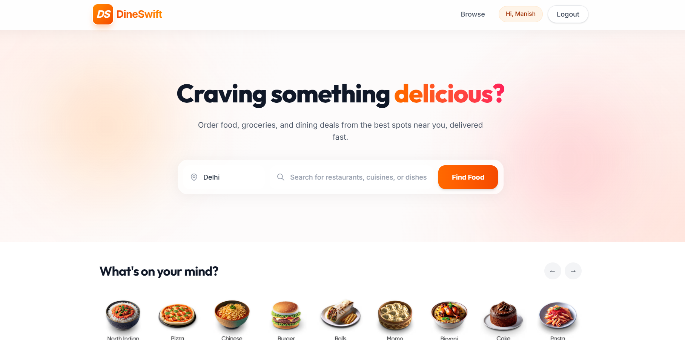
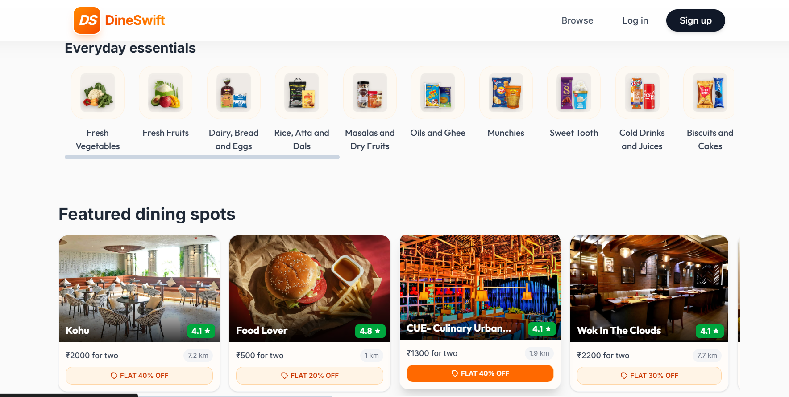
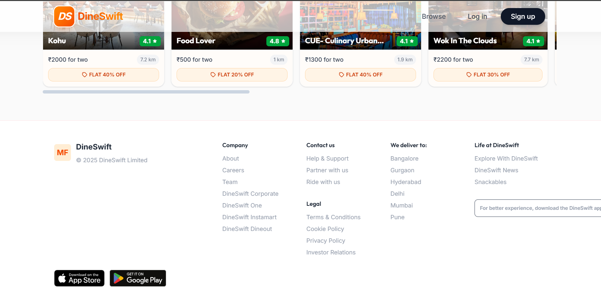
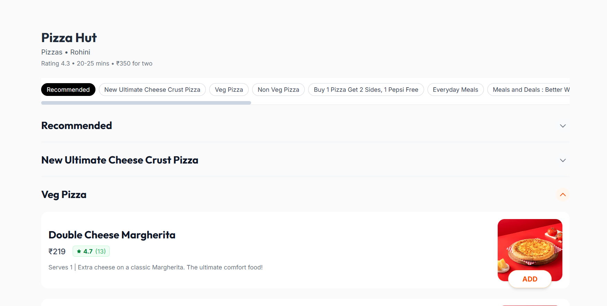

<div align="center">
  <h1>🍔 DineSwift</h1>
  <strong>A Premium, Highly Interactive Food Delivery Platform Frontend </strong><br>
  
</div>

## 🔗 Live Demo & Previews

**Live Demo:** [🔗https://dineswift.vercel.app](https://dineswift.vercel.app)

### 📸 Application Previews

<div align="center">
  <p><strong>Home & Discovery (Top)</strong></p>
  
</div>

<details open>
<summary><b>View More Screenshots (Homepage, Listings, Menus)</b></summary>
<br />

<div align="center">
  <p><strong>Home Page Features (Main & Footer)</strong></p>
  
  
</div>

<div align="center">
  <p><strong>Restaurant Listings & Advanced Filters</strong></p>
  
</div>

<div align="center">
  <p><strong>Restaurant Menu Page</strong></p>
  
</div>
</details>

---

## 🛠️ Tech Stack

<div align="center">
  
  
  
  
</div>

---

## ✨ Features

- **Robust Authentication**: Fully functional Login and Signup UI with protected route management. Users must authenticate to browse menus.
- **Dynamic Restaurant Menus**: Unique, auto-generated menu pages dependent on the specific restaurant selected.
- **Advanced Searching & Sorting**:
  - Instantly search for specific restaurants or dishes.
  - Filter listings by Ratings, Delivery Time, and Veg/Non-Veg options.
  - Sort results by Price (High to Low / Low to High), Recommended, or Fastest Delivery.
- **Micro-Interactions**: Premium feel with smooth hover effects, scaling animations, and skeleton loading (shimmer UI).
- **Responsive Design**: Flawless experience across Mobile, Tablet, and Desktop environments.

---

## 🏗️ Architecture & Flow

1. **User lands on Home Page** (`/`): Sees categorized food/grocery options and featured restaurants.
2. **Authentication Flow** (`/login`, `/signup`): Context API manages the auth state globally.
3. **Protected Navigation** (`/restaurant`): Higher-Order Components intercept routes. If authenticated, the user is granted access to the main listings.
4. **Data Retrieval**: App interfaces with DineSwift API utilities to dynamically generate layouts and restaurant specific content (`/city/delhi/:id`).
5. **Component Reusability**: Complex UIs are constructed using modular chunks (`Header`, `DineCard`, `RestCard`).

---

## 🧠 Key Learnings & Challenges

Building DineSwift presented several interesting technical challenges that required creative problem-solving and taught me valuable frontend concepts:

- **Overcoming API CORS Restrictions & Data Mocking**: While fetching restaurant data from public APIs, I faced CORS restrictions because browsers don't allow requests to some external servers. Since I couldn't access the API directly, I stored the required API response locally after inspecting the network requests. This helped me understand how real-world APIs return large JSON data.
- **Authentication & Route Gating**: I created an AuthContext to store whether a user is logged in. I also protected routes so users must log in before accessing pages like Cart or Profile. After logging in, they are redirected back to the page they originally wanted.
- **Complex UI State & Filtering**: I learned not to modify the original restaurant data directly. Instead, I kept one original list and another filtered list. This allowed me to apply multiple filters like rating, veg-only, and sorting without losing the original data.
- **Perceived Performance & UX**: Instead of showing a blank screen while data loads, I created a shimmer UI so users immediately see a loading layout. This improves the user experience because the app feels faster.

---

## 🚀 How to Run Locally

### Prerequisites
Make sure you have [Node.js](https://nodejs.org/) installed.

### Installation

1. **Clone the repository:**
   ```bash
   git clone https://github.com/manishcodess/dineswift.git
   cd dineswift
   ```

2. **Install dependencies:**
   ```bash
   npm install
   ```

3. **Start the development server:**
   ```bash
   npm run dev
   ```
   > The app will run on `http://localhost:1234`

---

## 📂 Project Structure & Data Simulation

```text
dineswift/
├── index.html                # App Root
├── package.json              # Dependencies
├── src/
│   ├── app.jsx               # Main Routing & Entry
│   ├── index.css             # Global Tailwind Styles
│   ├── assets/               # Local Images & Screenshots
│   ├── components/           # UI Components (Cards, Layouts, Shimmers)
│   ├── context/              # Global State (AuthContext)
│   ├── dineswiftapi/         # Simulated Data Fetching Logic
│   └── utilities/            # Captured & Trimmed API Responses
```

> **Note on Data Simulation:** This project originally targeted a public food delivery API directly. However, client-side requests are blocked by CORS since the API isn't designed for external consumption. As a workaround, real API responses were captured, trimmed from their massive original payloads down to a usable subset, and stored locally (in `dineswiftapi/` and `utilities/`) to simulate real network behavior for demo purposes.

---

## 👨‍💻 Author / Contact

**Manish**  
*Frontend Developer & React Enthusiast*

- 🌐 **Portfolio:** [@manishcodess](https://manishcodess.vercel.app)
- 💼 **LinkedIn:** [@manishcodess](https://linkedin.com/in/manishcodess)
- 🐙 **GitHub:** [@manishcodess](https://github.com/manishcodess)

<br />
<div align="center">
  <p>If you like this project, please consider giving it a ⭐!</p>
</div>

---

## 📄 License

This project is licensed under the [MIT License](LICENSE).
