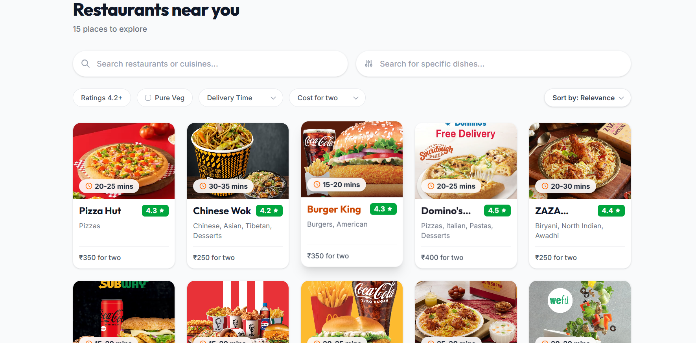

# 🍔 MealFlow UI - Food Delivery Frontend

A React food delivery interface with authentication, restaurant discovery, filtering, sorting, and menu browsing.

[](https://react.dev)
[](https://parceljs.org)
[](https://reactrouter.com)
[](https://tailwindcss.com)

---


## 📸 Screenshots

###  Home Page
Landing page with hero search, food categories, grocery items, and featured restaurants.


###  Login and Signup Page
User authentication with email/password login and account creation.


### 2 Restaurant Listing
Browse all restaurants with advanced search, filtering, and sorting capabilities.

---
## ✨ Features

### Home Page
- Hero search section
- Food & grocery carousels
- Featured restaurants
- Responsive design

### Restaurant Listing
- Search by restaurant name
- Filters: rating, veg/non-veg, delivery time, price
- Sort options: recommended, fastest, rating, price

### Restaurant Menu
- Dynamic menu display based on restaurant ID
- Menu items organized by category
- Restaurant info header

### Authentication
- Signup & Login forms
- Protected routes (must login to view restaurants/menu)
- Session management

---

## 🛠️ Tech Stack

| Technology | Version |
|-----------|---------|
| React | 19 |
| React Router | 6 |
| Parcel | 2 |
| Tailwind CSS | 4 |

---

## 📁 Project Structure

```
mealflow/
├── index.html                    # React root DOM
├── package.json                  # Dependencies & scripts
├── Readme.md                     # This file
├── src/
│   ├── app.jsx                   # Main app & routing
│   ├── index.css                 # Global styles
│   ├── context/
│   │   └── AuthContext.jsx       # Auth state management
│   ├── components/               # React components
│   ├── utilities/                # Mock data files
│   └── redux/                    # Store & slices
├── srcmore/                      # Restaurant listing features
├── srcpizza/                     # Menu display features
└── src/assets/                   # Screenshots (1.png, 2.png, 3.png, 4.png)
```

---

## 🚀 Quick Start

### 1. Install Dependencies
```bash
npm install
```

### 2. Run Development Server
```bash
npm run dev
```
Open `http://localhost:1234` in browser

### 3. Build for Production
```bash
npm run build
```
Output in `dist/` folder

---

## 🗺️ Routes

| Route | Purpose | Auth |
|-------|---------|------|
| `/` | Home page | ❌ |
| `/login` | Login form | ❌ |
| `/signup` | Sign up form | ❌ |
| `/restaurant` | Restaurant list | ✅ |
| `/city/delhi/:id` | Restaurant menu | ✅ |

**Note**: `/restaurant` and `/city/delhi/:id` require login

---

## 📚 Key Components

### Page Components
- `Home` - Landing page (`src/components/`)
- `Restaurantscards` - Restaurant listing (`srcmore/componentsmore/`)
- `RestaurantMenu` - Menu display (`srcpizza/Componentspizza/`)

### Feature Components
- `Header` - Navigation & search
- `Foodoptions / Groceryoptions` - Carousels
- `Login / Signup` - Auth pages
- `ProtectedRoute` - Route protection

### State Management
- `AuthContext` - User authentication state
- Mock data files - `Fooddata.js`, `Restaurantdatamore.jsx`, etc.

---

## 🔧 Troubleshooting

### Port Already in Use
```bash
npm run dev -- --port 3000
```

### Tailwind Styles Not Loading
- Check `src/index.css` has `@import "tailwindcss";`
- Check `index.html` imports `./src/index.css`

### Route Refresh Shows 404
Enable SPA fallback on your hosting provider:
- **Netlify**: Add `_redirects` file with `/* /index.html 200`
- **Vercel**: Auto-configured
- **GitHub Pages**: Use hash routing `/#/city/delhi/123`

---

## 🎓 Learning Concepts

✅ Component composition & hooks  
✅ Client-side routing (React Router)  
✅ Context API for state management  
✅ Protected routes & authentication  
✅ Real-time filtering & sorting  
✅ Responsive design (Tailwind CSS)  
✅ Mock data management  

See `DETAILED_COMMENTS_GUIDE.md` for code explanations.

---

## 🚀 Next Steps

- [ ] Backend API integration
- [ ] Shopping cart & checkout
- [ ] Order history
- [ ] User ratings & reviews
- [ ] Real-time order tracking
- [ ] PWA support

---

## 👨‍💻 Author

**Manish** (@manishcodess)
- Frontend Learner & React Enthusiast

### Connect
- GitHub: [manishcodess](https://github.com/manishcodess)
- LinkedIn: [Add your profile]
- Portfolio: [Add your portfolio]

---

## 📄 License

Free to use for learning purposes.

---

**Happy coding! 🎉**
